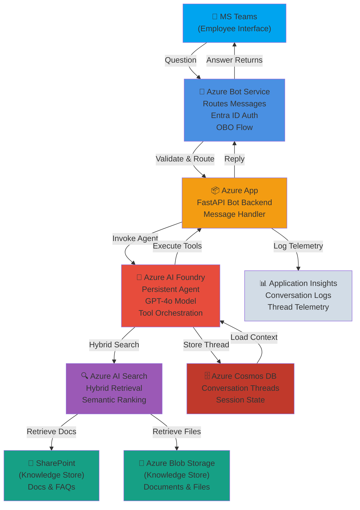
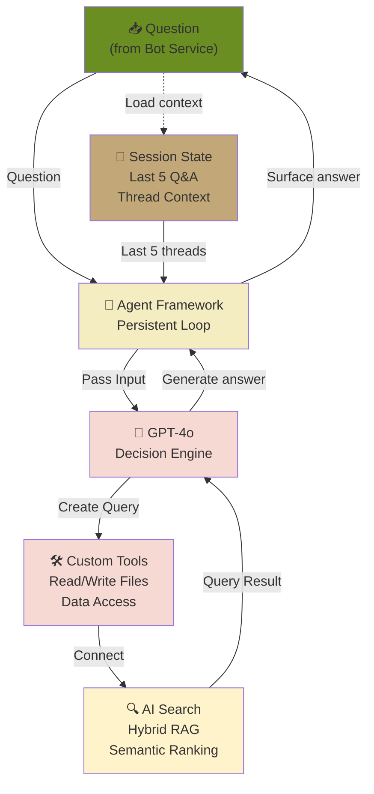

# ATLAS-RAG SharePoint Agent

An enterprise Retrieval-Augmented Generation (RAG) agent accessible via **MS Teams** that enables natural-language question-and-answer over SharePoint content. Built on **Azure Bot Service** for Teams integration and **Azure AI Foundry Agent Service** with GPT-4o, it uses Microsoft Entra ID On-Behalf-Of (OBO) flow to retrieve SharePoint data within the scope of the signed-in user's permissions.

---

## Architecture

### Full System Architecture



**Key Flows:**
- **Question Flow:** Employee asks in Teams → Bot Service routes → Agent invokes with context
- **Answer Flow:** Agent synthesizes answer → Bot Service → Teams (user sees response)

| Layer | Technology |
|---|---|
| **User Interface** | MS Teams (via Azure Bot Service) |
| **Bot Service** | Azure Bot Service (message routing, Entra ID authentication) |
| **Backend API** | FastAPI on Azure Container Apps (bot message handler + AI orchestration) |
| **AI Agent** | Azure AI Foundry Agent Service (GPT-4o + SharePoint tool + File Search) |
| **Search** | Azure AI Search — hybrid + semantic re-ranking |
| **Knowledge Store** | Microsoft SharePoint (documents, FAQs, organizational knowledge) |
| **Conversation Storage** | Azure Cosmos DB (NoSQL — `threads` & `conversations` containers) |
| **File Storage** | Azure Blob Storage (`agent-files` container) |
| **Authentication** | Microsoft Entra ID — On-Behalf-Of (OBO) flow for user-scoped SharePoint access |
| **Identity (service-to-service)** | User-Assigned Managed Identity — no connection strings in code |
| **Secrets** | Azure Key Vault |
| **Observability** | Azure Application Insights + Log Analytics |
| **Infrastructure as Code** | Azure Developer CLI (AZD) + Bicep |

---

## Agent Behavior & Loop

### Azure AI Foundry Agent Architecture



**Agent Architecture Details:**

- **Microsoft Agent Framework:** Orchestrates the persistent agent loop; manages state, tool invocation, and decision-making
- **Azure OpenAI Service (LLM):** GPT-4o model handles:
  - Understanding user questions
  - Deciding which tools to invoke
  - Synthesizing answers from retrieved documents and tool results
- **Custom Tools:** Customer-built tools that the agent can call:
  - File operations (read/write documents)
  - Data source access (databases, APIs)
  - Content summarization and analysis
- **Azure AI Search Connection:** Knowledge base connection provides:
  - Hybrid retrieval (keyword + semantic)
  - Semantic re-ranking for relevance
  - Scoped to user permissions via OBO flow
- **Session State Management:**
  - Maintains last 5 conversation turns for context awareness
  - Agent can reference prior questions/answers in current session
  - Automatically resets when user exits or after 15-minute timeout
  - Fresh session starts with empty context

### Telemetry & Logging

```mermaid
graph TB
    Agent["🧠 Agent Processes Query<br/>Runs Tools<br/>Synthesizes Answer"]
    
    Telemetry["📊 Telemetry Pipeline"]
    
    Agent -->|Every interaction| Log1["📋 Conversation Log<br/>- Question text<br/>- Retrieved documents<br/>- Agent response<br/>- Tokens used<br/>- Latency"]
    
    Agent -->|Thread lifecycle| Log2["🔗 Thread Identifier Log<br/>- Thread ID<br/>- User ID<br/>- Session start time<br/>- Session end time<br/>- Total turns"]
    
    Agent -->|Tool invocations| Log3["🛠️ Tool Usage Log<br/>- Tool name<br/>- Parameters<br/>- Result summary<br/>- Execution time"]
    
    Agent -->|Search operations| Log4["🔍 Search Log<br/>- Query text<br/>- Results count<br/>- Top scores<br/>- Re-ranking applied"]
    
    Log1 & Log2 & Log3 & Log4 --> Telemetry
    
    Telemetry -->|Separate database| AppInsights["🗄️ Application Insights<br/>Query Analytics<br/>Performance Metrics<br/>Error Tracking<br/>User Behavior"]
    
    Telemetry -->|Audit trail| CosmosDB["🗄️ Cosmos DB<br/>Conversation threads<br/>Session history<br/>Conversation containers"]
    
    AppInsights -->|Dashboards| Dashboard["📈 Analytics<br/>Q&A success rate<br/>Agent latency<br/>Tool usage patterns<br/>User engagement"]
    
    style Agent fill:#424242
    style Telemetry fill:#f39c12
    style Log1 fill:#00a4ef
    style Log2 fill:#3498db
    style Log3 fill:#16a085
    style Log4 fill:#9b59b6
    style AppInsights fill:#34495e
    style CosmosDB fill:#c0392b
    style Dashboard fill:#27ae60
```



**Telemetry Details:**
- **Logging Scope:** Every conversation turn and thread identifier is logged
- **Separate Database:** All telemetry is stored in **Application Insights** for analytics & monitoring
- **Audit Trail:** Conversation history also stored in **Cosmos DB** for compliance & user support
- **Metrics Tracked:**
  - Agent response latency
  - Search quality (hit rate, result relevance)
  - Tool invocation frequency & success rate
  - User engagement patterns
  - Error rates & failure modes

---

## Prerequisites

- [Azure CLI](https://learn.microsoft.com/en-us/cli/azure/install-azure-cli) (latest recommended)
- [Azure Developer CLI (AZD)](https://learn.microsoft.com/en-us/azure/developer/azure-developer-cli/install-azd) (latest recommended)
- [Bicep CLI](https://learn.microsoft.com/en-us/azure/azure-resource-manager/bicep/install) (installed via `az bicep install`)
- An Azure subscription with Contributor + User Access Administrator roles
- A Microsoft Entra ID app registration for the **Bot Service** (for MS Teams integration)
- A Microsoft Entra ID app registration with SharePoint delegated permissions (`Sites.Read.All` or broader) for **OBO flow**
- Access to a Microsoft 365 tenant with **MS Teams** enabled
- Python 3.11+ (for local development)
- Docker (for local container builds)
- [Bot Framework Emulator](https://github.com/Microsoft/BotFramework-Emulator) (for local testing, optional)

---

## Quick Start — Deploy to Azure

```bash
# 1. Log in to Azure
azd auth login

# 2. Create a dev environment (resource group: rg-rag-test-dev)
azd env new rag-test-dev

# 3. Provision all Azure resources (~15-20 min the first time)
azd provision

# 4. Build and deploy the container
azd deploy
```

For a production environment:

```bash
azd env new rag-test-prod
azd provision   # isProd=true activates Standard tiers, private endpoints, and HA replicas
azd deploy
```

---

## Environment Naming

| Environment | AZD env name | Resource Group |
|---|---|---|
| Development | `rag-test-dev` | `rg-rag-test-dev` |
| Production | `rag-test-prod` | `rg-rag-test-prod` |

The `isProd` flag is derived automatically from whether the environment name contains `prod`. It controls SKU tiers, replica counts, retention periods, and whether private networking is enabled.

---

## Repository Structure

```
fullRAG/
├── azure.yaml                      # AZD service definitions (bot service → Container Apps)
├── .env.example                    # Environment variable template for local dev
├── AGENTS.md                       # Copilot coding agent instructions
├── infra/
│   ├── main.bicep                  # Subscription-scoped entry point; creates resource group & deploys all modules
│   ├── main.parameters.json        # AZD-injected parameter values
│   ├── abbreviations.json          # Azure resource abbreviation map
│   └── modules/
│       ├── monitoring.bicep        # Log Analytics + Application Insights
│       ├── managed-identity.bicep  # User-Assigned Managed Identity
│       ├── key-vault.bicep         # Key Vault (RBAC-mode, soft delete)
│       ├── container-registry.bicep# Azure Container Registry
│       ├── bot-service.bicep       # Azure Bot Service + Entra ID App Registration
│       ├── ai-services.bicep       # Azure AI Services (GPT-4o + embeddings)
│       ├── ai-foundry.bicep        # AI Hub + AI Project + Capability Host
│       ├── ai-search.bicep         # Azure AI Search (hybrid + semantic)
│       ├── cosmos-db.bicep         # Cosmos DB — threads & conversations
│       ├── storage-account.bicep   # Blob Storage for agent files
│       ├── container-apps.bicep    # Container Apps Environment + bot backend
│       └── security.bicep          # All RBAC role assignments (centralized)
└── src/
    └── bot/
        ├── Dockerfile              # Python 3.11 slim, uvicorn on port 8000
        ├── main.py                 # FastAPI bot service entry point
        ├── requirements.txt        # Python dependencies (botframework, azure-ai-foundry)
        ├── bot_handler.py          # MS Teams message routing + Entra ID OBO
        └── ai_foundry_client.py    # AI Foundry agent orchestration
```

---

## Local Development

### Setup

1. **Copy and configure the environment file:**

   ```bash
   cp .env.example .env
   # Fill in all values — see .env.example for descriptions
   ```

2. **Install Python dependencies:**

   ```bash
   cd src/bot
   pip install -r requirements.txt
   ```

3. **Create local Entra ID app registration (if testing locally):**

   Use [Bot Framework Emulator](https://github.com/Microsoft/BotFramework-Emulator) to test the bot without a Teams connection, or:
   - Register an app in Entra ID Portal
   - Set `MICROSOFT_APP_ID` and `MICROSOFT_APP_PASSWORD` in `.env`

### Running Locally

**Option A: Direct FastAPI (for development)**

```bash
cd src/bot
uvicorn main:app --reload --port 8000
# Bot webhook available at http://localhost:8000/api/messages
```

**Option B: Docker (closer to production)**

```bash
docker build -t atlas-rag-bot ./src/bot
docker run -p 8000:8000 --env-file .env atlas-rag-bot
```

**Option C: Bot Framework Emulator (test without Teams)**

1. Launch Bot Framework Emulator
2. Connect to: `http://localhost:8000/api/messages`
3. Use `MICROSOFT_APP_ID` and `MICROSOFT_APP_PASSWORD` from `.env`
4. Send test messages to see the bot respond

### Authentication

- **Local development**: `DefaultAzureCredential` chains through environment variables → `az login` → MSI
  - Set `AZURE_CLIENT_ID`, `AZURE_CLIENT_SECRET`, `AZURE_TENANT_ID` in `.env` for service principal auth
  - Or run `az login` and let the code use your credentials
- **Production**: Container App uses `ManagedIdentityCredential` via injected `AZURE_CLIENT_ID` (no secrets stored)

### MS Teams Integration

To test with actual MS Teams:
1. Deploy the bot to Azure (via `azd deploy`)
2. In Azure Bot Service → Channels, enable MS Teams
3. Add the bot to a Teams channel or personal chat
4. Send a message → forwarded to the bot's webhook endpoint

---

## Environment Variables

| Variable | Description |
|---|---|
| `ENVIRONMENT` | `development` or `production` |
| `AZURE_CLIENT_ID` | Client ID of the User-Assigned Managed Identity |
| `AZURE_AI_PROJECT_ENDPOINT` | AI Foundry project endpoint URL |
| `AZURE_AI_SERVICES_ENDPOINT` | Azure AI Services (OpenAI) endpoint URL |
| `AZURE_COSMOS_ENDPOINT` | Cosmos DB account endpoint URL |
| `AZURE_SEARCH_ENDPOINT` | Azure AI Search service endpoint URL |
| `AZURE_KEY_VAULT_URL` | Key Vault URI |
| `APPLICATIONINSIGHTS_CONNECTION_STRING` | App Insights connection string |
| `AZURE_TENANT_ID` | Entra ID tenant ID (for OBO flow) |
| `AZURE_CLIENT_SECRET` | App registration client secret (OBO — local dev only) |
| `ENTRA_APP_CLIENT_ID` | Entra ID app registration client ID |
| `SHAREPOINT_SITE_URL` | SharePoint site URL to query |

All secrets (`AZURE_CLIENT_SECRET`, `APPLICATIONINSIGHTS_CONNECTION_STRING`, etc.) are stored in **Azure Key Vault**. In production, the Container App injects them at runtime via Key Vault references using the Managed Identity — they are never hard-coded or stored as plain-text environment variables in production deployments.

---

## Infrastructure Overview

All Azure resources are provisioned via Bicep modules orchestrated by `infra/main.bicep`:

| Phase | Resources |
|---|---|
| **Shared Services** | Log Analytics, Application Insights, User-Assigned Managed Identity, Key Vault, Container Registry |
| **Bot Integration** | Azure Bot Service, Entra ID App Registration (for Teams + OBO), Key Vault secrets for bot credentials |
| **AI & Data** | Azure AI Services (GPT-4o + embeddings), AI Foundry Hub + Project, Azure AI Search, Cosmos DB, Blob Storage |
| **Compute** | Container Apps Environment + Container App (Bot backend, FastAPI) |
| **Security** | RBAC role assignments (all in `security.bicep`), OBO flow for user-scoped SharePoint access |
| **Networking (prod)** | Private endpoints for all services, VNet, private DNS zones |

### Key Design Decisions

- **User-Assigned Managed Identity** — one identity for the Container App to authenticate to all backends; RBAC is pre-assigned before deployment.
- **RBAC centralized in `security.bicep`** — all role assignments in one place for auditability.
- **Cosmos DB serverless** (dev) / **autoscale** (prod) — cost-optimized for dev, predictable throughput for prod.
- **AI Search free tier** (dev) / **Standard** (prod) — sufficient for development, standard for hybrid + semantic ranking at scale.
- **Private endpoints** in prod only — balances security for regulated environments with development agility.

---

## Validate the Infrastructure (without deploying)

```bash
# Lint all Bicep files
az bicep build --file infra/main.bicep

# Preview changes (what-if)
az deployment sub what-if \
  --location eastus2 \
  --template-file infra/main.bicep \
  --parameters infra/main.parameters.json
```

---

## Contributing

1. Fork the repository and create a feature branch.
2. Follow the conventions in [AGENTS.md](./AGENTS.md) — no connection strings in code, use Managed Identity, store secrets in Key Vault.
3. Validate Bicep changes with `az bicep build` before opening a pull request.
4. Open a pull request targeting `main`.

---

## License

This project is licensed under the [MIT License](LICENSE).
